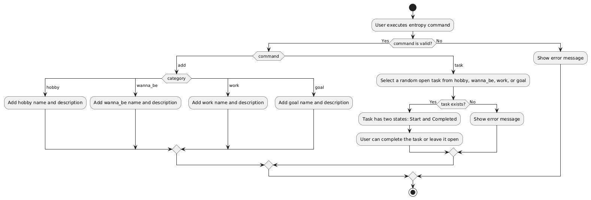
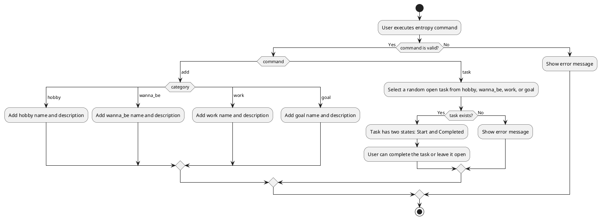

# Design 

Activity UML digram to create the desing state for `entropy` project.

### Source 

```plantuml
@startuml
start

:User executes entropy command;
if (command is valid?) then (Yes)
    switch( command )
        case ( add )
            switch( category )
                case ( hobby )
                    :Add hobby name and description;
                case ( wanna_be )
                    :Add wanna_be name and description;
                case ( work )
                    :Add work name and description;
                case ( goal )
                    :Add goal name and description;
            endswitch
        case ( task )
            :Select a random open task from hobby, wanna_be, work, or goal;
            if (task exists?) then (Yes)
                :Task has two states: Start and Completed;
                :User can complete the task or leave it open;
            else (No)
                :Show error message;
            endif
    endswitch
else (No)
    :Show error message;
endif

stop
@enduml
```

